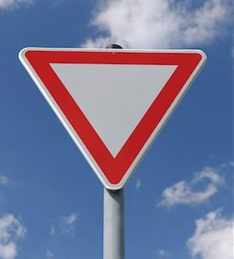
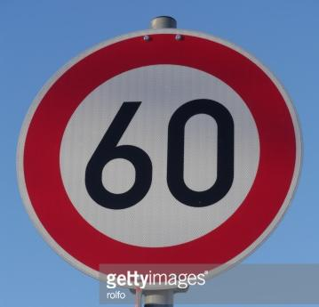
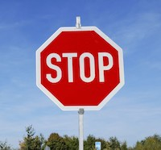
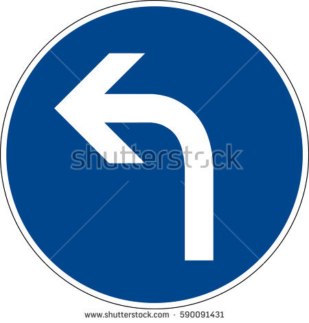

# **Traffic Sign Recognition** 

---

**Build a Traffic Sign Recognition Project**

The goals / steps of this project are the following:
* Load the data set (see below for links to the project data set)
* Explore, summarize and visualize the data set
* Design, train and test a model architecture
* Use the model to make predictions on new images
* Analyze the softmax probabilities of the new images
* Summarize the results with a written report

[//]: # (Image References)

[image1]: ./images/label_dist_train.png "Train labels distribution"
[image2]: ./images/label_dist_valid.png "Validation labels distribution"
[image3]: ./images/label_dist_test.png "Test labels distribution"
[image4]: ./images/10.png "Sign 10"
[image5]: ./images/norm_sign.png "Sign 10"

### Data Set Summary & Exploration

I used the pandas library to calculate summary statistics of the traffic
signs data set:

* The size of training set is 34799
* The size of the validation set is 4410
* The size of test set is 12630
* The shape of a traffic sign image is 32x32x2
* The number of unique classes/labels in the data set is 43

Here are bar charts showing how the labels of training, validation and testing set are distributed. Additionally, we plot a random sign with its label.

![alt text][image1]
![alt text][image2]
![alt text][image3]
![alt text][image4]

### Design and Test a Model Architecture

The one and only preprocessing step is the images were normalized by subtracting 128 and divinding by 255. Using normalized data makes converging of the gradient descent approach faster. Here is what a normalized image looks like:

![alt text][image5]

Converting the image to greyscale was tried as a normalization but this approach didn't give any significant improvement.

The model used follows closely the famous LeNet architecture. It consists of the following layers:

| Layer         		|     Description	        					| 
|:---------------------:|:---------------------------------------------:| 
| Input         		| 32x32x3 RGB image   							| 
| Convolution     	|  5x5 size, 1x1 stride, 8 depth, valid padding, outputs 28x28x8 	|
| RELU					|												|
| Max pooling	      	| 2x2 stride,  outputs 14x14x8 				|
| Convolution     	|  5x5 size, 1x1 stride, 16 depth, valid padding, outputs 10x10x16 	|
| Max pooling	      	| 2x2 stride,  outputs 5x5x16 				|
| RELU					|												|
| Fully connected		| outputs 250        									|
| RELU					|												|
| Dropout					|												|
| Fully connected		| outputs 100       									|
| RELU					|												|
| Dropout					|												|
| Fully connected		| outputs 43       									|
 
Since initially the validation accuracy was too low a dropout layer was added to prevent overfitting and help the model to generalize better.

To train the model, stocastic gradient descent with the Adam method for optimization was used.
 
The final model results are:
* training set accuracy of 0.998
* validation set accuracy of 0.954
* test set accuracy of 0.941

 

### Test a Model on New Images

Here are five German traffic signs that I found on the web:

The model might have difficulty recognizing the images since most of them are not with equal width/height. Additionally sign 5 have wateramarks which adds noise to the image and could make the prediction more difficult.

Here are the results of the prediction:

| Image			        |     Prediction	        					| 
|:---------------------:|:---------------------------------------------:| 
| Yield					| Yield											|
| Speed limit (60km/h)      		| Speed limit (60km/h)   									| 
| Stop     			| Priority road 										|
| Right-of-way at the next intersection	      		| Right-of-way at the next intersection					 				|
| Turn left ahead 			| Turn left ahead      							|

The model was able to correctly guess 4 of the 5 traffic signs, which gives an accuracy of 80%. This compares favorably to the accuracy on the test set of 0.941

For the first, second, forth image the model is relatively sure what the sign is, it guesses correctly the fifth sign and for the third the correct prediction is the 3rd one in top 5. The top five soft max probabilities of the first image are:

| Probability         	|     Prediction	        					| 
|:---------------------:|:---------------------------------------------:| 
| 1.000         			| Yield   									| 
| 0.000     				| No passing 										|
| 0.000					|No passing for vehicles over 3.5 metric tons|
| 0.000	      			|Ahead only|
| 0.000				    | Speed limit (60km/h)|

For the second image:

| Probability         	|     Prediction	        					| 
|:---------------------:|:---------------------------------------------:| 
| 1.000         			| Speed limit (60km/h)| 
| 0.000     				| Speed limit (50km/h)|
| 0.000					|Speed limit (80km/h)|
| 0.000	      			|Speed limit (30km/h)|
| 0.000				    |End of all speed and passing limits|

For the third image:

| Probability         	|     Prediction	        					| 
|:---------------------:|:---------------------------------------------:| 
| 0.887         			|Priority road| 
| 0.113     				|No entry|
| 0.000					|Stop|
| 0.000      			|No passing for vehicles over 3.5 metric tons|
| 0.000				    |Yield|

For the forth image:

| Probability         	|     Prediction	        					| 
|:---------------------:|:---------------------------------------------:| 
| 1.000         			|Right-of-way at the next intersection| 
| 0.000     				|Beware of ice/snow|
| 0.000					|Pedestrians|
| 0.000	      			|Double curve|
| 0.000				    |Vehicles over 3.5 metric tons prohibited|

For the fifth image:

| Probability         	|     Prediction	        					| 
|:---------------------:|:---------------------------------------------:| 
| 0.623         			|Turn left ahead| 
| 0.190     				|Dangerous curve to the right|Turn right ahead
| 0.183					|Roundabout mandatory|
| 0.003	      			|Keep right|
| 0.000				    |Turn right ahead|

